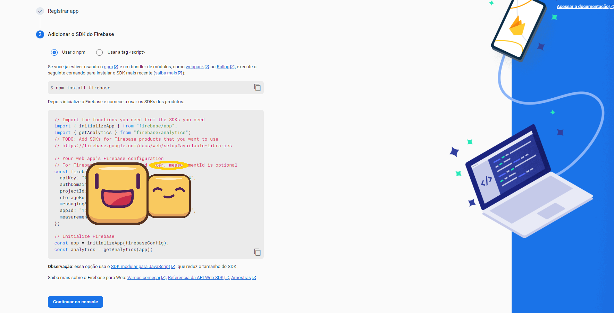

**Tutorial: Instalação do Node.js e Yarn**

Antes de começar a criar seu projeto React Native, é importante ter o Node.js e o Yarn instalados no seu sistema. Aqui estão os passos para fazer isso:

**Node.js**: Primeiro, certifique-se de ter o Node.js instalado. Se você ainda não o tem, siga os passos abaixo:

Acesse o site oficial do Node.js em nodejs.org.
Baixe a versão LTS (Long Term Support) recomendada para sua plataforma (Windows, macOS ou Linux).

Siga o assistente de instalação para concluir a instalação.

**Yarn**: O Yarn é um gerenciador de pacotes que facilita a instalação e gerenciamento de dependências. Para instalá-lo, siga as etapas a seguir:

Abra um terminal ou prompt de comando.

Execute o seguinte comando para instalar o Yarn globalmente:

    npm install -g yarn

Aguarde o término da instalação.

Agora que você tem o Node.js e o Yarn instalados, você está pronto para criar seu projeto React Native. Siga as instruções a seguir:

Agora, com o Node.js e o Yarn instalados, você pode prosseguir com a criação do seu projeto React Native. Aqui estão as etapas:

Primeiro, crie um novo projeto Expo com o comando a seguir:

    yarn create expo-app NOMEDOPROJETO

Isso configurará todos os componentes básicos necessários para iniciar um projeto React Native. Como planejamos usar TypeScript, renomearemos o arquivo "App.js" para "App.tsx".

Para iniciar o projeto, utilize o seguinte comando:

    yarn expo start

Quando solicitado, pressione "Y" e pressione Enter para instalar as dependências relacionadas ao TypeScript.

Agora você pode testar o projeto no aplicativo "Expo Go" ou usar um emulador, como o Android Studio. Lembre-se de que a segunda opção pode consumir muita memória RAM, o que pode prejudicar o desempenho do seu sistema, caso você não tenha memória suficiente para o desenvolvimento de aplicativos.

Em seguida, você precisará instalar as dependências necessárias para criar três telas para o aplicativo: SignIn, SignUp e AuthorizedScreen. As dependências que usaremos são o Formik e o Yup para validação de dados, e o react-native-paper, que fornece componentes de interface de usuário estilizados e pré-configurados.

Execute o seguinte comando para instalar essas dependências:

    yarn add formik yup react-native-paper

Recomenda-se fazer um commit no Git após a instalação dessas dependências para rastrear as alterações.

Agora você está pronto para desenvolver seu aplicativo React Native com as dependências instaladas e configuradas.

Após isso, iremos configurar o firebase em nosso projeto. Caso seja um programador de primeira viagem utilizando o "Firebase Authentication", recomendo que leia exclusivamente a documentação para entender/compreender o funcionamento da tecnologia.

    yarn add firebase

É necessário que crie uma conta Google, e entre no site da "Firebase", crie um novo projeto e entre na aba Authentication. Após isso, clique na engrenagem em "Visão Geral do Projeto" e "Configurações do Projeto". Role a tela para baixo, e em "Seus aplicativos", clique em "Adicionar App". Após isso, esses dados que serão disponibilizados para você, serão úteis para a configuração do sistema firebase em seu projeto.

Crie uma pasta chamada "Config", e um arquivo "firebase.ts". Nesse arquivo, coloque o código informado através do console do firebase.

Como medida de segurança essencial, é necessário que crie dois arquivos - .env.local e .env.test. Onde ".env.local" será onde você informará as suas credenciais informadas pelo firebase, enquanto o .env.test, será apenas as variáveis de ambiente do projeto.

Exemplo no arquivo .env.local:

    EXPO_PUBLIC_APIKEY = XXXXXXXXXX

(Observe que, a variável começa com "EXPO_PUBLIC" e os valores sempre não contém aspas e vírgula ao final.)

Antes de criamos o firebase.ts na pasta config, é necessário criarmos o .env.local e preencher os seguintes campos com as credenciais disponibilizada na criação do projeto no firebase.

    EXPO_PUBLIC_APIKEY=
    EXPO_PUBLIC_AUTHDOMAIN=
    EXPO_PUBLIC_PROJECTID=
    EXPO_PUBLIC_STORAGEBUCKET=
    EXPO_PUBLIC_MESSAGINGSENDERID=
    EXPO_PUBLIC_APPID=
    EXPO_PUBLIC_MEASUREMENTID=

Recomendo, realizar um git commit nesse estágio.

Também, é necessário realizar a instalação da dependência do react-native-navigation para a gestão de rotas autorizadas e não-autorizadas.

    yarn add @react-navigation/native
    yarn expo install react-native-screens react-native-safe-area-context
    yarn add @react-navigation/native-stack

Após a instalação das dependências responsáveis pela navegação, é necessário definir as rotas na pasta chamada "routes".

Iremos precisar de outra dependência chamada expo-secure-store, responsável para armazenamento do token de login - isso é necessário para verificar se o usuário já fez autenticação anteriormente, e se o token é válido futuramente no authContext.

Depois de algum tempo, lembro-me que deve-se ser instalada outra dependência:

    yarn add @react-native-async-storage/async-storage

O código do firebase.ts ficará do seguinte modo:

    import AsyncStorage from '@react-native-async-storage/async-storage';
    import { initializeApp } from 'firebase/app';
    import \* as firebaseAuth from 'firebase/auth';

    const reactNativePersistence = (firebaseAuth as any).getReactNativePersistence;

    // TODO: Add SDKs for Firebase products that you want to use
    // https://firebase.google.com/docs/web/setup#available-libraries

    // Your web app's Firebase configuration
    // For Firebase JS SDK v7.20.0 and later, measurementId is optional
    const firebaseConfig = {
    apiKey: process.env.EXPO_PUBLIC_APIKEY,
    authDomain: process.env.EXPO_PUBLIC_AUTHDOMAIN,
    projectId: process.env.EXPO_PUBLIC_PROJECTID,
    storageBucket: process.env.FIREBSE_STORAGEBUCKET,
    messagingSenderId: process.env.EXPO_PUBLIC_MESSAGINGSENDERID,
    appId: process.env.EXPO_PUBLIC_APPID,
    measurementId: process.env.EXPO_PUBLIC_MEASUREMENTID,
    };

    // Initialize Firebase
    const app = initializeApp(firebaseConfig);
    // Initialize Firebase Authentication and get a reference to the service
    const auth = firebaseAuth.initializeAuth(app, {
    persistence: reactNativePersistence(AsyncStorage),
    });

    export { auth };

Agora precisamos definir o authContext do arquivo authContext.tsx:

    import * as React from 'react';
    import * as SecureStore from 'expo-secure-store';

    import {
    createUserWithEmailAndPassword,
    getAuth,
    signInWithEmailAndPassword,
    } from 'firebase/auth';

    const AuthContext = React.createContext({
    authContext: {
        signIn: (data) => {},
        signOut: () => {},
        signUp: (data) => {},
    },
    state: {
        isLoading: true,
        isSignout: false,
        userToken: null,
    },
    });

    function AuthProvider({ children }) {
    const auth = getAuth();

    const [state, dispatch] = React.useReducer(
        (prevState, action) => {
        switch (action.type) {
            case 'RESTORE_TOKEN':
            return {
                ...prevState,
                userToken: action.token,
                isLoading: false,
            };
            case 'SIGN_IN':
            return {
                ...prevState,
                isSignout: false,
                userToken: action.token,
            };
            case 'SIGN_OUT':
            return {
                ...prevState,
                isSignout: true,
                userToken: null,
            };
        }
        },
        {
        isLoading: true,
        isSignout: false,
        userToken: null,
        }
    );

    React.useEffect(() => {
        // Verifique se o usuário está logado
        const bootstrapAsync = async () => {
        let userToken;

        try {
            userToken = await SecureStore.getItemAsync('userToken');
        } catch (e) {
            // Restaurar o token falho
            console.error(e);
        }

        dispatch({ type: 'RESTORE_TOKEN', token: userToken });
        };

        bootstrapAsync();
    }, []);

    const authContext = React.useMemo(
        () => ({
        signIn: async (data) => {
            const { email, password } = data;

            try {
            // O método signInWithEmailAndPassword retorna um objeto do tipo UserCredential
            const userCredential = await signInWithEmailAndPassword(
                auth,
                email,
                password
            );

            // O token do usuário só é obtido após a autenticação
            const userToken = await userCredential.user.getIdToken();

            // Lembre-se de que, em uma aplicação de produção, precisamos armazenar o token
            await SecureStore.setItemAsync('userToken', userToken);

            // Aqui, definimos o token do usuário no estado global
            dispatch({ type: 'SIGN_IN', token: userToken });
            } catch (error) {
            console.log(error);
            }
        },
        signOut: async () => {
            // Em uma aplicação de produção, precisamos remover o token do usuário do armazenamento
            await SecureStore.deleteItemAsync('userToken');

            // O token do usuário é removido do estado global
            dispatch({ type: 'SIGN_OUT' });
        },

        signUp: async (data) => {
            // O método createUserWithEmailAndPassword retorna um objeto do tipo UserCredential
            const userCredential = await createUserWithEmailAndPassword(
            auth,
            data.email,
            data.password
            );

            // O token do usuário só é obtido após a autenticação
            const userToken = await userCredential.user.getIdToken();

            // Lembre-se de que, em uma aplicação de produção, precisamos armazenar o token
            await SecureStore.setItemAsync('userToken', userToken);

            // Aqui, definimos o token do usuário no estado global
            dispatch({ type: 'SIGN_IN', token: userToken });
        },
        }),
        []
    );

    return (
        <AuthContext.Provider
        value={{
            authContext,
            state,
        }}
        >
        {children}
        </AuthContext.Provider>
    );
    }

    const useAuth = () => React.useContext(AuthContext);

    export { AuthContext, AuthProvider, useAuth };

Após isso, deveremos atualizar o código em routes/index.tsx:

    import { NavigationContainer } from '@react-navigation/native';
    import { createNativeStackNavigator } from '@react-navigation/native-stack';
    import React from 'react';
    import { StyleSheet } from 'react-native';
    import { Home, SignIn, SignUp } from '../screens';
    import { useAuth } from '../contexts/authContext';

    const Stack = createNativeStackNavigator();

    const AuthorizedRoutes = () => {
    return (
        <Stack.Navigator>
        <Stack.Screen name="Home" component={Home} />
        </Stack.Navigator>
    );
    };

    const UnauthorizedRoutes = () => {
    return (
        <Stack.Navigator>
        <Stack.Screen name="SignIn" component={SignIn} />
        <Stack.Screen name="SignUp" component={SignUp} />
        </Stack.Navigator>
    );
    };

    const Routes = () => {
    const { state } = useAuth();

    return (
        <NavigationContainer>
        {state.userToken ? <AuthorizedRoutes /> : <UnauthorizedRoutes />}
        </NavigationContainer>
    );
    };

    export default Routes;

    const styles = StyleSheet.create({});

Aqui, já temos um sistema de autenticação quase completa. Precisaremos apenas definir o signOut e o signUp.

Agora iremos criar a tela de desconexão do usuário na tela Home:

    import React from 'react';
    import { StyleSheet, Text, TouchableOpacity, View } from 'react-native';
    import { useAuth } from '../contexts/authContext';

    const Home = () => {
    const { authContext } = useAuth();

    return (
        <View>
        <TouchableOpacity
            onPress={() => {
            authContext.signOut();
            }}
            style={styles.button}
        >
            <Text style={styles.buttonText}>Deslogar</Text>
        </TouchableOpacity>
        </View>
    );
    };

    export default Home;

    const styles = StyleSheet.create({
    button: {
        backgroundColor: '#d90202',
        margin: 10,
        padding: 10,
        borderRadius: 10,
        alignItems: 'center',
    },
    buttonText: {
        color: '#fff',
        fontSize: 18,
    },
    });

Agora, é apenas configurar a tela de SignUp (Tela de cadastro):

    import React from 'react';
    import { StyleSheet, Text, TouchableOpacity, View } from 'react-native';
    import { Formik } from 'formik';
    import * as yup from 'yup';
    import { TextInput } from 'react-native-paper';
    import { useAuth } from '../contexts/authContext';

    const SignUp = () => {
    const { authContext } = useAuth();

    return (
        <>
        <Formik
            initialValues={{ email: '', password: '', confirmPassword: '' }}
            onSubmit={(values) =>
            authContext.signUp({
                email: values.email,
                password: values.password,
            })
            }
            validationSchema={yup.object().shape({
            email: yup
                .string()
                .email('E-mail inválido.')
                .required('E-mail é um campo obrigatório.'),
            password: yup
                .string()
                .min(4, 'Senha deve ter no mínimo 4 caracteres.')
                .max(10, 'Senha deve ter no máximo 10 caracteres.')
                .required('Senha é um campo obrigatório.'),
            confirmPassword: yup
                .string()
                .oneOf([yup.ref('password'), null], 'Senhas devem ser iguais.')
                .required('Confirmação de senha é um campo obrigatório.'),
            })}
        >
            {({
            errors,
            handleChange,
            handleBlur,
            handleSubmit,
            touched,
            values,
            }) => (
            <>
                <View style={styles.inputContainer}>
                <TextInput
                    style={styles.input}
                    onChangeText={handleChange('email')}
                    onBlur={handleBlur('email')}
                    value={values.email}
                    placeholder="E-mail"
                    autoCapitalize="none"
                />

                {errors.email && touched.email && (
                    <Text style={styles.error}>{errors.email}</Text>
                )}
                </View>

                <View style={styles.inputContainer}>
                <TextInput
                    style={styles.input}
                    onChangeText={handleChange('password')}
                    onBlur={handleBlur('password')}
                    value={values.password}
                    placeholder="Senha"
                    secureTextEntry={true}
                    autoCapitalize="none"
                />
                {errors.password && touched.password && (
                    <Text style={styles.error}>{errors.password}</Text>
                )}
                </View>

                <View style={styles.inputContainer}>
                <TextInput
                    style={styles.input}
                    onChangeText={handleChange('confirmPassword')}
                    onBlur={handleBlur('confirmPassword')}
                    value={values.confirmPassword}
                    placeholder="Confirmação de senha"
                    secureTextEntry={true}
                    autoCapitalize="none"
                />
                {errors.confirmPassword && touched.confirmPassword && (
                    <Text style={styles.error}>{errors.confirmPassword}</Text>
                )}
                </View>

                <TouchableOpacity
                style={styles.button}
                onPress={() => {
                    handleSubmit();
                }}
                >
                <Text style={styles.textButton}>Faça o seu cadastro</Text>
                </TouchableOpacity>
            </>
            )}
        </Formik>
        </>
    );
    };

    export default SignUp;

    const styles = StyleSheet.create({
    inputContainer: {
        margin: 10,
    },
    input: {
        height: 40,
        width: '90%',
        alignSelf: 'center',
    },
    error: {
        color: 'red',
        fontSize: 12,
        alignSelf: 'center',
    },
    button: {
        backgroundColor: '#00b94a',
        padding: 10,
        borderRadius: 5,
        width: '90%',
        alignSelf: 'center',
        alignItems: 'center',
    },
    textButton: {
        color: '#fff',
        fontWeight: 'bold',
    },
    });
